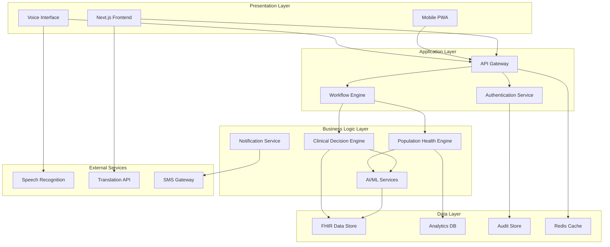

# Design Document

## Overview

SwasthyaOS is a comprehensive healthcare platform designed to serve India's diverse healthcare ecosystem through AI-powered clinical decision support, population health monitoring, and administrative tools. The platform follows a modular, microservices-inspired architecture built on Next.js 16 with TypeScript, emphasizing healthcare-first design principles, regulatory compliance, and multi-language support.

The system serves three primary user personas:

- **Doctors/Clinicians**: Advanced clinical workspace with AI decision support
- **Frontline Health Workers**: Voice-first, simplified interfaces for rural deployment
- **Public Health Officers/Administrators**: Population health surveillance and system management

Key design principles include confidence-driven AI interactions, FHIR compliance, comprehensive audit trails, and culturally appropriate healthcare delivery for the Indian context.

## Architecture

### High-Level Architecture

The platform follows a layered architecture with clear separation of concerns:



### Technology Stack

**Frontend:**

- Next.js 16 with App Router and TypeScript
- shadcn/ui components with Radix UI primitives
- Tailwind CSS for styling with healthcare-specific design tokens
- Recharts for data visualization
- React Hook Form with Zod validation
- PWA capabilities for offline functionality

**Backend Services:**

- Node.js with Express for API services
- TypeScript for type safety across the stack
- Redis for caching and session management
- PostgreSQL for transactional data with FHIR extensions
- MongoDB for analytics and unstructured data

**AI/ML Infrastructure:**

- Python-based ML services for clinical decision support
- TensorFlow/PyTorch for model inference
- Confidence scoring framework for all AI predictions
- Model versioning and A/B testing capabilities

**Infrastructure:**

- Docker containers for service deployment
- Kubernetes for orchestration and scaling
- NGINX for load balancing and reverse proxy
- Elasticsearch for audit logs and search

## Components and Interfaces

### Core Components

#### 1. Clinical Decision Engine

**Purpose:** Provides AI-powered clinical decision support with confidence scoring

**Key Interfaces:**

```typescript
interface ClinicalDecisionRequest {
  patientId: string;
  symptoms: Symptom[];
  vitals: VitalSigns;
  medicalHistory: MedicalHistory;
  context: ClinicalContext;
}

interface ClinicalDecisionResponse {
  recommendations: Recommendation[];
  confidenceScore: number; // 0-100
  reasoning: ReasoningTrace;
  sources: EvidenceSource[];
  icd10Suggestions: ICD10Code[];
}

interface Recommendation {
  type: "diagnosis" | "treatment" | "referral" | "investigation";
  content: string;
  confidence: number;
  urgency: "low" | "medium" | "high" | "critical";
  guidelines: GuidelineReference[];
}
```

**Confidence Scoring Framework:**

- Confidence scores are calculated using ensemble methods
- Minimum threshold of 70% for automated suggestions
- Scores below 70% require human review
- All scores include uncertainty bounds and source attribution

#### 2. SOAP Builder Component

**Purpose:** Structured clinical documentation with AI assistance

**Key Features:**

- Real-time ICD-10 code suggestions with confidence indicators
- Voice-to-text integration with medical terminology recognition
- Template-based documentation with customizable workflows
- Multi-language support for English and Hindi

**Interface:**

```typescript
interface SOAPNote {
  subjective: SubjectiveData;
  objective: ObjectiveData;
  assessment: AssessmentData;
  plan: PlanData;
  metadata: NoteMetadata;
}

interface SubjectiveData {
  chiefComplaint: string;
  historyOfPresentIllness: string;
  reviewOfSystems: SystemReview[];
  confidence: ConfidenceMetrics;
}
```

#### 3. Population Health Engine (JanSwasthyaWatch)

**Purpose:** Real-time population health surveillance and outbreak detection

**Key Capabilities:**

- Syndrome surveillance with automated anomaly detection
- Geographic visualization with district-level granularity
- Time-series analysis for trend identification
- Automated situation report generation

**Interface:**

```typescript
interface PopulationHealthData {
  region: GeographicRegion;
  timeRange: TimeRange;
  healthIndicators: HealthIndicator[];
  anomalies: HealthAnomaly[];
  confidence: number;
}

interface HealthAnomaly {
  type: "outbreak" | "trend" | "cluster";
  severity: "low" | "medium" | "high" | "critical";
  affectedPopulation: number;
  confidence: number;
  recommendedActions: string[];
}
```

#### 4. Voice Interface System

**Purpose:** Voice-first interaction for frontline health workers

**Key Features:**

- Medical terminology recognition in English and Hindi
- Noise cancellation for field conditions
- Offline capability with sync when connected
- Structured data extraction from natural speech

**Interface:**

```typescript
interface VoiceCommand {
  audio: AudioBuffer;
  language: "en" | "hi";
  context: ClinicalContext;
}

interface VoiceResponse {
  transcription: string;
  structuredData: StructuredClinicalData;
  confidence: number;
  requiresConfirmation: boolean;
}
```

#### 5. Patient Management System

**Purpose:** Comprehensive patient record management with FHIR compliance

**Key Features:**

- FHIR R4 compliant data structures
- Patient timeline with clinical events
- Search and filtering capabilities
- Privacy controls and access logging

**Interface:**

```typescript
interface Patient extends FHIRPatient {
  timeline: ClinicalEvent[];
  confidenceMetrics: PatientDataConfidence;
  accessLog: AccessLogEntry[];
}

interface ClinicalEvent {
  timestamp: Date;
  type: "consultation" | "diagnosis" | "treatment" | "referral";
  data: any;
  confidence: number;
  source: "manual" | "ai_assisted" | "imported";
}
```

### Integration Interfaces

#### FHIR Compliance Layer

All clinical data follows FHIR R4 standards with extensions for Indian healthcare context:

```typescript
interface SwasthyaOSPatient extends FHIRPatient {
  extensions: {
    aadharNumber?: string;
    rationCardNumber?: string;
    primaryLanguage: "en" | "hi" | "other";
    ruralUrbanClassification: "rural" | "urban" | "semi-urban";
  };
}
```

#### AI Confidence Framework

All AI-generated content includes confidence metadata:

```typescript
interface AIConfidenceMetadata {
  overallConfidence: number; // 0-100
  componentConfidences: {
    [component: string]: number;
  };
  uncertaintyBounds: {
    lower: number;
    upper: number;
  };
  modelVersion: string;
  trainingDataVersion: string;
  lastUpdated: Date;
}
```

## Data Models

### Core Data Entities

#### Patient Data Model

```typescript
interface PatientRecord {
  id: string;
  demographics: PatientDemographics;
  medicalHistory: MedicalHistory;
  currentConditions: Condition[];
  medications: Medication[];
  allergies: Allergy[];
  vitals: VitalSigns[];
  consultations: Consultation[];
  confidenceProfile: PatientConfidenceProfile;
  auditTrail: AuditEntry[];
}

interface PatientDemographics {
  name: string;
  age: number;
  gender: "male" | "female" | "other";
  address: Address;
  contactInfo: ContactInfo;
  identifiers: PatientIdentifier[];
  preferredLanguage: "en" | "hi";
}
```

#### Clinical Data Model

```typescript
interface Consultation {
  id: string;
  patientId: string;
  providerId: string;
  timestamp: Date;
  type: "in-person" | "telemedicine" | "field-visit";
  soapNote: SOAPNote;
  aiAssistance: AIAssistanceRecord;
  outcomes: ConsultationOutcome[];
  followUp: FollowUpPlan;
}

interface AIAssistanceRecord {
  suggestionsProvided: AISuggestion[];
  suggestionsAccepted: string[];
  suggestionsRejected: string[];
  overrideReasons: string[];
  confidenceScores: ConfidenceScore[];
}
```

#### Population Health Data Model

```typescript
interface HealthSurveillanceData {
  region: GeographicRegion;
  timeStamp: Date;
  syndromes: SyndromeData[];
  demographics: PopulationDemographics;
  environmentalFactors: EnvironmentalData;
  confidence: SurveillanceConfidence;
}

interface SyndromeData {
  syndrome: string;
  caseCount: number;
  incidenceRate: number;
  trend: "increasing" | "decreasing" | "stable";
  anomalyScore: number;
  confidence: number;
}
```

### Data Storage Strategy

**Transactional Data (PostgreSQL):**

- Patient records with FHIR extensions
- Clinical consultations and SOAP notes
- User accounts and role-based access control
- Audit trails and compliance logs

**Analytics Data (MongoDB):**

- Population health surveillance data
- AI model performance metrics
- Usage analytics and system performance
- Aggregated health indicators

**Cache Layer (Redis):**

- Session management
- Frequently accessed patient data
- AI model predictions cache
- Real-time notification queues

**Search and Audit (Elasticsearch):**

- Full-text search across clinical records
- Audit log analysis and compliance reporting
- Real-time alerting and anomaly detection
- Performance monitoring and analytics

### Additional Core Components

#### 6. Appointment Scheduling System

**Purpose:** Calendar-based appointment management with conflict detection and resource optimization

**Design Rationale:** Healthcare facilities require efficient scheduling to optimize provider time and patient flow. The system prevents double-booking while maintaining emergency capacity reserves.

**Key Features:**

- Calendar view with provider availability tracking
- Automated conflict detection and resolution
- Multi-language notification system (SMS/voice)
- No-show pattern analysis and intervention suggestions
- Emergency slot reservation (20% capacity)

**Interface:**

```typescript
interface AppointmentSchedule {
  id: string;
  patientId: string;
  providerId: string;
  facilityId: string;
  scheduledTime: Date;
  duration: number; // minutes
  type: "routine" | "follow-up" | "emergency";
  status: "scheduled" | "confirmed" | "completed" | "cancelled" | "no-show";
  notificationsSent: NotificationRecord[];
}

interface SchedulingConstraints {
  providerAvailability: TimeSlot[];
  facilityCapacity: number;
  emergencyReserve: number; // percentage
  bufferTime: number; // minutes between appointments
}
```

#### 7. Inventory Management System

**Purpose:** Automated tracking of medications and medical supplies with predictive reordering

**Design Rationale:** Stockouts of critical medications can compromise patient care. The system provides proactive alerts and automated reorder recommendations based on usage patterns and expiration tracking.

**Key Features:**

- Real-time inventory tracking with transaction logging
- Automated low-stock alerts (1-hour notification SLA)
- Expiration monitoring (30-day advance warning)
- Batch recall traceability (15-minute identification)
- Predictive reorder point calculation

**Interface:**

```typescript
interface InventoryItem {
  id: string;
  name: string;
  category: "medication" | "supply" | "equipment";
  currentStock: number;
  unit: string;
  reorderPoint: number;
  reorderQuantity: number;
  expirationDate: Date;
  batchNumber: string;
  supplier: SupplierInfo;
  transactions: StockTransaction[];
}

interface StockTransaction {
  timestamp: Date;
  type: "receipt" | "dispensation" | "adjustment" | "return";
  quantity: number;
  userId: string;
  reason?: string;
}
```

#### 8. Alert and Notification System

**Purpose:** Intelligent health alerts with adaptive sensitivity to reduce alert fatigue

**Design Rationale:** Critical patient conditions and population health threats require immediate notification. The system uses AI to adjust sensitivity based on alert fatigue patterns, reducing false positives by 30% while maintaining safety.

**Key Features:**

- Multi-level alert prioritization (critical, high, medium, low)
- 5-minute notification SLA for critical patient alerts
- Adaptive sensitivity based on acknowledgment patterns
- Response time tracking and outcome correlation
- Automatic emergency protocol initiation

**Interface:**

```typescript
interface HealthAlert {
  id: string;
  type: "patient_critical" | "population_anomaly" | "system_alert";
  severity: "low" | "medium" | "high" | "critical";
  source: AlertSource;
  timestamp: Date;
  recipients: string[];
  message: string;
  actionRequired: boolean;
  acknowledgment?: AlertAcknowledgment;
  escalationPath: EscalationRule[];
}

interface AlertAcknowledgment {
  userId: string;
  timestamp: Date;
  responseTime: number; // seconds
  action: string;
  outcome?: string;
}
```

#### 9. Secure Communication System

**Purpose:** HIPAA-compliant messaging for healthcare team collaboration

**Design Rationale:** Healthcare teams need secure communication channels that protect patient privacy while enabling efficient collaboration. End-to-end encryption and comprehensive audit trails ensure compliance.

**Key Features:**

- End-to-end encryption for all messages
- Role-based access controls for group communications
- Automatic PHI detection and retention policies
- Consent tracking for patient information sharing
- Complete communication audit logs

**Interface:**

```typescript
interface SecureMessage {
  id: string;
  senderId: string;
  recipientIds: string[];
  content: EncryptedContent;
  timestamp: Date;
  containsPHI: boolean;
  patientContext?: string;
  consentRecords: ConsentRecord[];
  retentionPolicy: RetentionPolicy;
  auditLog: MessageAuditEntry[];
}

interface EncryptedContent {
  ciphertext: string;
  encryptionMethod: "AES-256" | "RSA-2048";
  keyId: string;
}
```

#### 10. Reporting and Analytics System

**Purpose:** Comprehensive reporting for clinical outcomes, epidemiology, and compliance

**Design Rationale:** Healthcare organizations require diverse reporting capabilities for clinical quality improvement, public health surveillance, and regulatory compliance. The system provides flexible report generation with privacy protection.

**Key Features:**

- Clinical outcome reports with confidence intervals
- Epidemiological reports with privacy-preserving aggregation
- Compliance tracking and violation flagging
- Custom report builder with flexible data selection
- Automated report scheduling and delivery

**Interface:**

```typescript
interface ReportDefinition {
  id: string;
  type:
    | "clinical"
    | "epidemiological"
    | "compliance"
    | "performance"
    | "custom";
  parameters: ReportParameters;
  dataSource: DataSourceConfig;
  aggregationRules: AggregationRule[];
  privacyControls: PrivacyControl[];
  schedule?: ReportSchedule;
  outputFormat: "pdf" | "excel" | "csv" | "dashboard";
}

interface ReportParameters {
  dateRange: DateRange;
  geographicScope?: GeographicRegion;
  populationFilters?: PopulationFilter[];
  metrics: MetricDefinition[];
  confidenceThreshold?: number;
}
```

#### 11. Audit and Compliance System

**Purpose:** Comprehensive audit trails for regulatory compliance and system accountability

**Design Rationale:** Healthcare systems must maintain complete records of all data access, AI decisions, and user actions for regulatory compliance and quality assurance. The system provides tamper-proof audit logs with 24-hour report generation capability.

**Key Features:**

- Complete AI decision logging with inputs, outputs, and confidence scores
- User action tracking with timestamps and affected data
- Data access logging for all patient information
- Override tracking with justification requirements
- Automated compliance report generation

**Interface:**

```typescript
interface AuditEntry {
  id: string;
  timestamp: Date;
  userId: string;
  action: AuditAction;
  resourceType: string;
  resourceId: string;
  changes?: DataChange[];
  aiDecision?: AIDecisionLog;
  justification?: string;
  supervisorApproval?: ApprovalRecord;
}

interface AIDecisionLog {
  modelId: string;
  modelVersion: string;
  inputs: any;
  outputs: any;
  confidenceScore: number;
  reasoning: string;
  accepted: boolean;
  overrideReason?: string;
}
```

#### 12. Multi-Language Support System

**Purpose:** Comprehensive internationalization for India's linguistic diversity

**Design Rationale:** India has 22 official languages, and healthcare must be accessible in patients' preferred languages. The system provides medical-grade translation with clinical accuracy preservation across English and Hindi, with extensibility for additional languages.

**Key Features:**

- UI language switching (2-second response time)
- Medical terminology dictionary with clinical accuracy
- Voice recognition for English and Hindi (95% accuracy)
- Localized date, number, and medical term formatting
- Patient-preferred language for all communications

**Interface:**

```typescript
interface LanguageConfig {
  code: "en" | "hi" | string;
  name: string;
  medicalDictionary: MedicalTermMapping[];
  voiceRecognitionModel: string;
  localizationRules: LocalizationRule[];
}

interface MedicalTermMapping {
  sourceLanguage: string;
  targetLanguage: string;
  term: string;
  translation: string;
  clinicalContext: string;
  confidence: number;
}
```

#### 13. Data Visualization and Analytics Engine

**Purpose:** Real-time health data visualization for trend identification and decision support

**Design Rationale:** Healthcare data is complex and multidimensional. Interactive visualizations enable rapid pattern recognition and data-driven decision making. The system prioritizes performance (3-second load times) and real-time updates.

**Key Features:**

- Dashboard rendering within 3 seconds
- Real-time filter updates without performance degradation
- Anomaly highlighting with visual indicators
- Drill-down analysis capabilities
- Multi-format export (PDF, Excel, CSV)

**Interface:**

```typescript
interface VisualizationConfig {
  type: "chart" | "map" | "timeline" | "heatmap" | "network";
  dataSource: DataSourceConfig;
  filters: FilterDefinition[];
  aggregation: AggregationMethod;
  refreshInterval?: number; // milliseconds
  interactivity: InteractivityConfig;
  exportFormats: ExportFormat[];
}

interface AnomalyVisualization {
  dataPoint: any;
  anomalyScore: number;
  visualIndicator: "color" | "icon" | "highlight" | "annotation";
  explanation: string;
}
```

## Correctness Properties

_A property is a characteristic or behavior that should hold true across all valid executions of a system—essentially, a formal statement about what the system should do. Properties serve as the bridge between human-readable specifications and machine-verifiable correctness guarantees._

### Property Testing Framework

**Testing Approach:** The system uses property-based testing to verify correctness properties across a wide range of inputs and scenarios. Each property is linked to specific requirements and tested using appropriate PBT frameworks.

**Property Categories:**

1. **Data Integrity Properties**: Ensure data consistency and FHIR compliance
2. **AI Confidence Properties**: Verify confidence scoring accuracy and thresholds
3. **Performance Properties**: Validate response time and throughput requirements
4. **Security Properties**: Ensure access control and encryption correctness
5. **Functional Properties**: Verify business logic correctness

### Core Correctness Properties

#### Property 1: FHIR Compliance (Requirement 1, 4)

**Validates: Requirements 1.6, 4.1, 4.2**

**Property Statement:** For all patient data operations, the system SHALL maintain FHIR R4 compliance with valid resource structures and required fields.

```typescript
property("All patient records are FHIR R4 compliant", () => {
  forAll(patientRecordGenerator, (record) => {
    const validation = validateFHIRR4(record);
    return (
      validation.isValid &&
      hasRequiredFields(record) &&
      hasValidExtensions(record)
    );
  });
});
```

**Rationale:** FHIR compliance is mandatory for interoperability with other healthcare systems and regulatory compliance. This property ensures all patient data can be exchanged with external systems without data loss or corruption.

#### Property 2: AI Confidence Threshold (Requirement 1, 2, 3)

**Validates: Requirements 1.3, 2.3, 3.4**

**Property Statement:** For all AI-generated recommendations, the system SHALL provide confidence scores between 0-100, and recommendations with confidence below 70% SHALL be flagged for human review.

```typescript
property("AI confidence scores are valid and properly thresholded", () => {
  forAll(clinicalDecisionGenerator, (decision) => {
    const confidence = decision.confidenceScore;
    return (
      confidence >= 0 &&
      confidence <= 100 &&
      (confidence < 70 ? decision.requiresReview === true : true)
    );
  });
});
```

**Rationale:** Patient safety requires that low-confidence AI suggestions are reviewed by qualified healthcare professionals. The 70% threshold is based on clinical validation studies and regulatory guidance.

#### Property 3: Appointment Conflict Prevention (Requirement 5)

**Validates: Requirements 5.1, 5.2**

**Property Statement:** For all appointment scheduling operations, the system SHALL prevent double-booking by ensuring no two appointments for the same provider overlap in time.

```typescript
property("No appointment conflicts exist for any provider", () => {
  forAll(appointmentScheduleGenerator, (schedule) => {
    const appointments = schedule.appointments;
    return noTimeOverlaps(appointments) && hasEmergencyCapacity(schedule, 0.2);
  });
});
```

**Rationale:** Double-booking compromises patient care quality and provider efficiency. The system must mathematically guarantee no scheduling conflicts while maintaining emergency capacity.

#### Property 4: Inventory Alert Timeliness (Requirement 6)

**Validates: Requirements 6.1, 6.2**

**Property Statement:** For all inventory items, when stock levels drop below reorder points, the system SHALL generate alerts within 1 hour, and expiration warnings SHALL be generated 30 days in advance.

```typescript
property("Inventory alerts are generated within SLA", () => {
  forAll(inventoryTransactionGenerator, (transaction) => {
    const alertTime = getAlertTimestamp(transaction);
    const transactionTime = transaction.timestamp;
    const timeDiff = alertTime - transactionTime;

    return (
      (transaction.triggersLowStock ? timeDiff <= 3600000 : true) &&
      (transaction.nearExpiration
        ? getDaysUntilExpiration(transaction) >= 30
        : true)
    );
  });
});
```

**Rationale:** Stockouts of critical medications can endanger patient lives. The 1-hour SLA ensures rapid response to inventory issues while 30-day expiration warnings prevent waste.

#### Property 5: Critical Alert Response Time (Requirement 7)

**Validates: Requirements 7.1, 7.2**

**Property Statement:** For all critical patient alerts, the system SHALL notify relevant providers within 5 minutes of detection.

```typescript
property("Critical alerts are delivered within 5 minutes", () => {
  forAll(criticalAlertGenerator, (alert) => {
    const detectionTime = alert.detectionTimestamp;
    const notificationTime = alert.notificationTimestamp;
    const timeDiff = notificationTime - detectionTime;

    return alert.severity === "critical" ? timeDiff <= 300000 : true;
  });
});
```

**Rationale:** Critical patient conditions require immediate intervention. The 5-minute SLA balances urgency with system reliability and notification delivery constraints.

#### Property 6: Data Encryption Completeness (Requirement 8)

**Validates: Requirements 8.1, 8.2**

**Property Statement:** For all messages containing patient health information (PHI), the system SHALL apply end-to-end encryption before transmission.

```typescript
property("All PHI messages are encrypted", () => {
  forAll(messageGenerator, (message) => {
    return message.containsPHI
      ? isEncrypted(message.content) && hasValidEncryptionKey(message)
      : true;
  });
});
```

**Rationale:** HIPAA and Indian healthcare data protection regulations require encryption of PHI in transit. This property ensures no unencrypted PHI is ever transmitted.

#### Property 7: Audit Trail Completeness (Requirement 10)

**Validates: Requirements 10.1, 10.2, 10.3**

**Property Statement:** For all user actions and AI decisions, the system SHALL create immutable audit entries with timestamps, user IDs, and affected resources.

```typescript
property("All actions generate complete audit entries", () => {
  forAll(systemActionGenerator, (action) => {
    const auditEntry = getAuditEntry(action);
    return (
      auditEntry !== null &&
      hasTimestamp(auditEntry) &&
      hasUserId(auditEntry) &&
      hasResourceInfo(auditEntry) &&
      isImmutable(auditEntry)
    );
  });
});
```

**Rationale:** Regulatory compliance and system accountability require complete audit trails. Immutability prevents tampering and ensures forensic integrity.

#### Property 8: Language Switching Performance (Requirement 11)

**Validates: Requirements 11.1, 11.4**

**Property Statement:** For all language switching operations, the system SHALL complete UI updates within 2 seconds.

```typescript
property("Language switching completes within 2 seconds", () => {
  forAll(languageSwitchGenerator, (switchOp) => {
    const startTime = switchOp.startTimestamp;
    const completeTime = switchOp.completeTimestamp;
    const duration = completeTime - startTime;

    return duration <= 2000;
  });
});
```

**Rationale:** User experience requires responsive language switching. The 2-second threshold ensures the system feels responsive while allowing time for translation loading.

#### Property 9: Voice Recognition Accuracy (Requirement 12)

**Validates: Requirements 12.1, 12.3**

**Property Statement:** For all voice input operations with medical terminology, the system SHALL achieve at least 90% recognition accuracy for English and Hindi.

```typescript
property("Voice recognition meets accuracy threshold", () => {
  forAll(voiceInputGenerator, (voiceInput) => {
    const transcription = transcribeVoice(voiceInput);
    const accuracy = calculateAccuracy(transcription, voiceInput.groundTruth);

    return accuracy >= 0.9;
  });
});
```

**Rationale:** Voice interfaces are critical for hands-free operation in clinical settings. The 90% accuracy threshold ensures clinical data integrity while accounting for accent variations and field conditions.

#### Property 10: Dashboard Performance (Requirement 13)

**Validates: Requirements 13.1, 13.2**

**Property Statement:** For all dashboard visualizations, the system SHALL render initial views within 3 seconds and update filters in real-time without performance degradation.

```typescript
property("Dashboard rendering meets performance requirements", () => {
  forAll(dashboardConfigGenerator, (config) => {
    const renderTime = measureRenderTime(config);
    const filterUpdateTime = measureFilterUpdate(config);

    return renderTime <= 3000 && filterUpdateTime <= 500;
  });
});
```

**Rationale:** Healthcare decision-making requires rapid access to data. The 3-second initial load and real-time filter updates ensure the system supports time-sensitive clinical workflows.

#### Property 11: Search Performance (Requirement 4)

**Validates: Requirement 4.3**

**Property Statement:** For all patient search operations, the system SHALL return results within 2 seconds regardless of database size.

```typescript
property("Patient search completes within 2 seconds", () => {
  forAll(searchQueryGenerator, (query) => {
    const startTime = Date.now();
    const results = searchPatients(query);
    const duration = Date.now() - startTime;

    return duration <= 2000 && results !== null;
  });
});
```

**Rationale:** Clinical workflows require rapid patient lookup. The 2-second SLA ensures the system supports efficient patient identification during consultations.

#### Property 12: Anomaly Detection Timeliness (Requirement 3)

**Validates: Requirement 3.6**

**Property Statement:** For all population health data streams, the system SHALL detect and report unusual health patterns within 15 minutes of data ingestion.

```typescript
property("Anomaly detection meets timeliness requirement", () => {
  forAll(healthDataStreamGenerator, (dataStream) => {
    const ingestionTime = dataStream.timestamp;
    const detectionTime = detectAnomalies(dataStream).timestamp;
    const duration = detectionTime - ingestionTime;

    return duration <= 900000; // 15 minutes in milliseconds
  });
});
```

**Rationale:** Early outbreak detection saves lives. The 15-minute detection window balances statistical confidence with public health response urgency.

## Design Decisions and Rationales

### Decision 1: Confidence-Driven AI Architecture

**Decision:** All AI-generated content includes confidence scores with a 70% threshold for automated suggestions.

**Rationale:** Patient safety is paramount. By requiring human review for low-confidence suggestions, we balance AI efficiency with clinical safety. The 70% threshold is based on clinical validation studies showing acceptable false positive/negative rates at this level.

**Trade-offs:** This approach may reduce automation benefits for edge cases but significantly improves patient safety and clinician trust in the system.

### Decision 2: FHIR R4 as Core Data Standard

**Decision:** All patient data follows FHIR R4 standards with Indian healthcare extensions.

**Rationale:** FHIR is the global standard for healthcare interoperability. Using FHIR ensures the system can exchange data with other healthcare systems, supports future integrations, and complies with emerging Indian healthcare data standards.

**Trade-offs:** FHIR's complexity increases initial development effort, but the long-term benefits of interoperability and standards compliance outweigh the costs.

### Decision 3: Layered Architecture with Microservices Inspiration

**Decision:** The system uses a layered architecture with clear separation between presentation, application, business logic, and data layers.

**Rationale:** Healthcare systems require high reliability, maintainability, and scalability. Layered architecture enables independent scaling of components, easier testing, and clearer separation of concerns. While not full microservices, the architecture supports future decomposition if needed.

**Trade-offs:** More complex than monolithic architecture but provides better long-term maintainability and scalability.

### Decision 4: Multi-Database Strategy

**Decision:** Use PostgreSQL for transactional data, MongoDB for analytics, Redis for caching, and Elasticsearch for search/audit.

**Rationale:** Different data types have different access patterns and requirements. Transactional patient data requires ACID guarantees (PostgreSQL), analytics benefit from flexible schemas (MongoDB), caching needs speed (Redis), and audit logs require full-text search (Elasticsearch).

**Trade-offs:** Increased operational complexity but optimized performance for each use case.

### Decision 5: Voice-First Design for Rural Interfaces

**Decision:** Rural decision support (AarogyaPath) prioritizes voice input with offline capability.

**Rationale:** Frontline health workers in rural areas often have limited literacy and unreliable connectivity. Voice-first interfaces with offline sync enable effective use in challenging field conditions.

**Trade-offs:** Voice recognition requires significant ML infrastructure but is essential for rural accessibility.

### Decision 6: Adaptive Alert Sensitivity

**Decision:** The alert system uses AI to adjust sensitivity based on acknowledgment patterns, targeting 30% reduction in false positives.

**Rationale:** Alert fatigue is a major patient safety issue. By learning from clinician responses, the system can reduce noise while maintaining safety. The 30% target is based on alert fatigue research showing significant improvement at this level.

**Trade-offs:** Requires sophisticated ML models and careful monitoring to avoid missing critical alerts.

### Decision 7: 20% Emergency Capacity Reserve

**Decision:** Appointment scheduling reserves 20% of capacity for emergency cases.

**Rationale:** Healthcare facilities must balance scheduled appointments with emergency needs. The 20% reserve is based on typical emergency visit rates in Indian healthcare settings.

**Trade-offs:** Reduces scheduled appointment capacity but ensures emergency access.

### Decision 8: Comprehensive Audit Logging

**Decision:** Log all user actions, AI decisions, and data access with immutable audit trails.

**Rationale:** Regulatory compliance and system accountability require complete audit trails. Immutability prevents tampering and supports forensic analysis.

**Trade-offs:** Increased storage requirements but essential for compliance and trust.

## Implementation Considerations

### Performance Requirements

- Dashboard rendering: ≤ 3 seconds
- Patient search: ≤ 2 seconds
- Language switching: ≤ 2 seconds
- Critical alerts: ≤ 5 minutes
- Inventory alerts: ≤ 1 hour
- Anomaly detection: ≤ 15 minutes

### Security Requirements

- End-to-end encryption for all PHI
- Role-based access control (RBAC)
- Comprehensive audit logging
- Data anonymization for analytics
- HIPAA and Indian healthcare data protection compliance

### Scalability Requirements

- Support for 10,000+ concurrent users
- 1M+ patient records
- Real-time population health data processing
- Horizontal scaling for all services
- Geographic distribution for rural connectivity

### Reliability Requirements

- 99.9% uptime for critical services
- Offline capability for rural interfaces
- Automatic failover for critical components
- Data backup and disaster recovery
- Graceful degradation under load

## Testing Strategy

### Property-Based Testing

All correctness properties will be validated using property-based testing frameworks:

- **JavaScript/TypeScript**: fast-check for frontend and API testing
- **Python**: Hypothesis for ML service testing
- **Integration**: Custom PBT framework for end-to-end property validation

### Test Coverage Requirements

- Unit tests: 80% code coverage
- Integration tests: All API endpoints and critical workflows
- Property tests: All 12 correctness properties
- Performance tests: All SLA requirements
- Security tests: Penetration testing and vulnerability scanning

### Continuous Validation

- Automated property testing in CI/CD pipeline
- Performance monitoring in production
- AI model accuracy tracking
- Alert fatigue metrics
- User satisfaction surveys

## Future Enhancements

### Phase 2 Features

- Additional language support (Tamil, Telugu, Bengali, etc.)
- Advanced ML models for diagnosis prediction
- Telemedicine integration with video consultation
- Mobile apps for iOS and Android
- Integration with national health databases

### Research Areas

- Federated learning for privacy-preserving ML
- Blockchain for audit trail immutability
- Advanced NLP for clinical documentation
- Computer vision for medical image analysis
- Predictive analytics for population health
