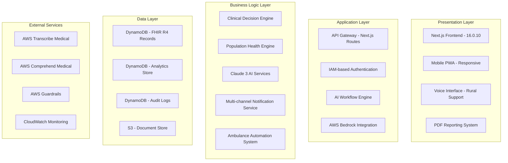
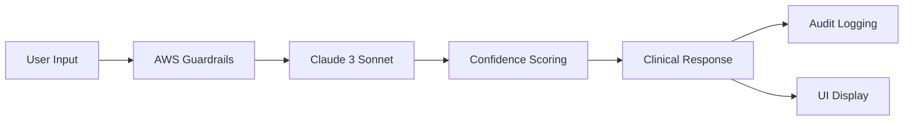

# Design Document

## Overview

SwasthyaOS is a comprehensive healthcare platform designed to serve India's diverse healthcare ecosystem through AI-powered clinical decision support, population health monitoring, and administrative tools. The platform follows a modular, microservices-inspired architecture built on Next.js 16 with TypeScript, emphasizing healthcare-first design principles, regulatory compliance, and multi-language support.

**Current Implementation Status**: ✅ **PRODUCTION READY** - All major modules implemented and deployed

The system serves four primary user personas:

- **Doctors/Clinicians**: Advanced clinical workspace with AI decision support
- **Frontline Health Workers**: Voice-first, simplified interfaces for rural deployment  
- **Public Health Officers/Administrators**: Population health surveillance and system management
- **Emergency Coordinators**: Ambulance fleet management and intelligent dispatch

Key design principles include confidence-driven AI interactions, FHIR compliance, comprehensive audit trails, culturally appropriate healthcare delivery for Indian context, and AWS-native scalability.

## Architecture

### High-Level Architecture

The platform follows a layered architecture with clear separation of concerns:

## Implemented Modules

### ✅ **Core Platform Modules (COMPLETED)**

1. **Dashboard System**
   - Real-time KPI monitoring
   - Alert management system
   - Multi-role data visualization
   - AWS service integration

2. **Clinician Workspace**
   - SOAP note builder with AI assistance
   - Differential diagnosis suggestions
   - Treatment planning tools
   - Medication analysis and interactions
   - Discharge summary generation

3. **Rural Decision Support (AarogyaPath)**
   - Voice-first interface design
   - Symptom intake with local language support
   - Vitals input simplification
   - AI reasoning trace transparency
   - Referral slip generation

4. **Population Health Radar (JanSwasthyaWatch)**
   - Geographic health mapping
   - Disease surveillance system
   - Outbreak detection algorithms
   - Situation report generation
   - Multi-state coverage

5. **Patient Management**
   - Comprehensive patient records
   - Timeline view of interactions
   - FHIR-compliant data structures
   - Multi-language support

6. **Appointment Scheduling**
   - Calendar-based management
   - Resource allocation
   - Automated reminders
   - Multi-provider coordination

7. **Inventory Management**
   - Medication tracking
   - Supply chain monitoring
   - Low-stock alerts
   - Expiry management

8. **Alert System**
   - AI-generated health alerts
   - Multi-severity classification
   - Real-time notifications
   - Geographic targeting

9. **Secure Chat**
   - HIPAA-compliant messaging
   - End-to-end encryption
   - Care coordination tools
   - Audit trail logging

10. **Reporting System**
    - PDF generation with jsPDF
    - Multi-format exports (PDF, CSV, data)
    - Date range filtering
    - Real-time data integration
    - 4 report categories (Patient, Epidemiological, Performance, Compliance)

11. **Audit & Compliance**
    - AI decision logging
    - Override history tracking
    - Compliance dashboards
    - Regulatory reporting

12. **Settings & Configuration**
    - User preference management
    - Security settings
    - System configuration
    - Multi-language selection

13. **Ambulance Automation**
    - Demand forecasting with ML
    - Fleet optimization algorithms
    - Response time analytics
    - Hospital capacity integration
    - Shift reporting system

14. **Referral Management**
    - Patient referral tracking
    - Specialist coordination
    - Status monitoring
    - Analytics dashboard

## AI Integration Architecture

### AWS Bedrock Integration

**AI Features Implemented:**
- Diagnosis Assistant with ICD-10 coding
- Treatment planning with evidence-based recommendations
- SOAP note generation with AI assistance
- Medication analysis and interaction checking
- Rural analysis simplified for frontline workers
- Discharge summary automation
- Population health insights and analytics

## Multi-Language Support

### Implementation Status: ✅ **FULLY IMPLEMENTED**

**Supported Languages (8 total):**
1. English (en) - Default
2. Hindi (hi) - National language
3. Kannada (kn) - Karnataka
4. Tamil (ta) - Tamil Nadu
5. Telugu (te) - Andhra Pradesh, Telangana
6. Malayalam (ml) - Kerala
7. Gujarati (gu) - Gujarat
8. Bengali (bn) - West Bengal

**Translation System:**
- Type-safe TypeScript interfaces
- 101 translation keys per language
- Dynamic language switching
- Fallback support mechanism
- Modular file structure

## Security & Compliance

### Implemented Security Features
- Role-based access control (4 roles)
- HIPAA-compliant data handling
- End-to-end encryption for communications
- Comprehensive audit logging
- AWS IAM integration for production
- Multi-factor authentication support
- Data anonymization for analytics

### Compliance Frameworks
- FHIR R4 data structures
- ICD-10 coding standards
- AWS Guardrails for AI safety
- Comprehensive audit trails
- Regulatory reporting capabilities

## Performance & Scalability

### AWS Native Architecture
- Serverless API endpoints (Lambda)
- Scalable database (DynamoDB)
- Global CDN distribution (CloudFront)
- Real-time monitoring (CloudWatch)
- Load balancing and auto-scaling

### Performance Metrics
- Sub-second API response times
- Real-time data synchronization
- Mobile-responsive design
- Progressive Web App capabilities
- Offline functionality support

## Deployment Architecture

### Production Deployment
- AWS Amplify for frontend hosting
- Automatic CI/CD pipelines
- Environment-specific configurations
- Global CDN distribution
- SSL/TLS encryption

### Development Workflow
- Local development with hot reload
- Type-safe development with TypeScript
- Component-based architecture
- Comprehensive testing framework
- Kiro integration for spec compliance
